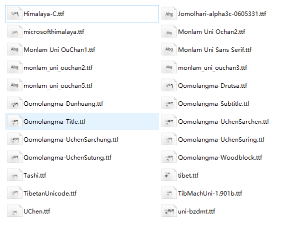
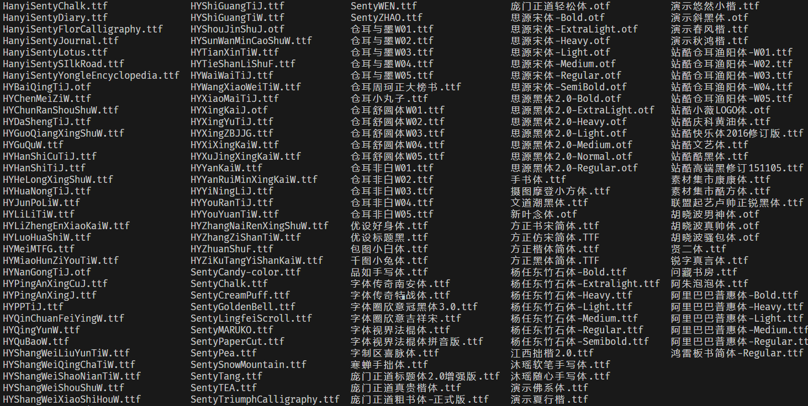
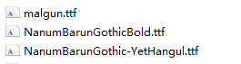

#### 藏文字体

**来源**： 网络收集

- [下载链接](https://pan.baidu.com/s/1c0OveG6SEy5AcqjUi2Pk-Q) | 提取码: 4k2w

- 示例：

   

#### 中英手写体

**来源：** [100font网站](https://www.100font.com/)

- [下载链接1](https://pan.baidu.com/s/1M367CZ71sparIZjP8B8JDg ) | 提取码: pe9v

- 示例：

    

#### 中英印刷体

**来源：**[Color_OCR_image_generator](https://github.com/zcswdt/Color_OCR_image_generator)

- [下载链接1](https://pan.baidu.com/s/1dRp70rEVeauu9rWB7bfGZw) | 提取码: 8kzt
- [下载链接2](https://pan.baidu.com/s/1aHkYSxactHm4u5eEiqHDAA) | 提取码: s58p
- 示例：

#### 韩文

**来源**：[naver](https://www.naver.com/)

- [下载链接1](https://pan.baidu.com/s/1OFe1e92xeOJ2K_FRAJmrtA)  | 提取码: qp98

- 示例：

    

#### 持续更新中…
